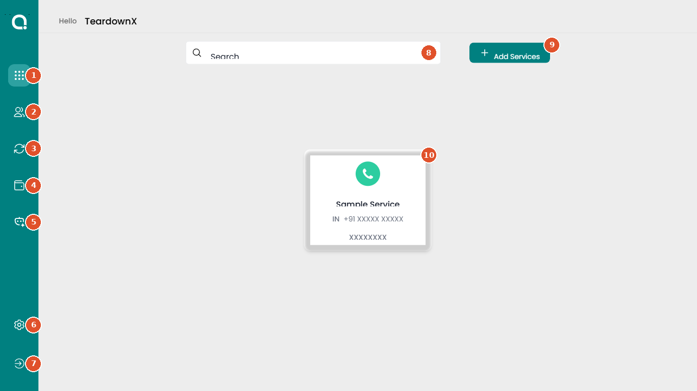

# Screen name exactly as shown in the product

Area › Module · Menu › Section › Tab

One or two sentences: what someone comes to this screen to do.

| Who can access | Plans | Last checked |
|---|---|---|
| Admin only | All plans | YYYY-MM-DD |

## Controls on this screen

The numbers match the markers on the screenshot.

| # | Control | Type | What it does | Default | Notes |
|---|---|---|---|---|---|
| 1 | **Exact label** | Button | Describe the effect, not the click. | Off | Limits, dependencies, gotchas |
| 2 | **Exact label** | Toggle | | | |

## Common mistakes

- What customers or colleagues misunderstand on this screen.

## Related screens

- Screens that affect, or depend on, this one.
