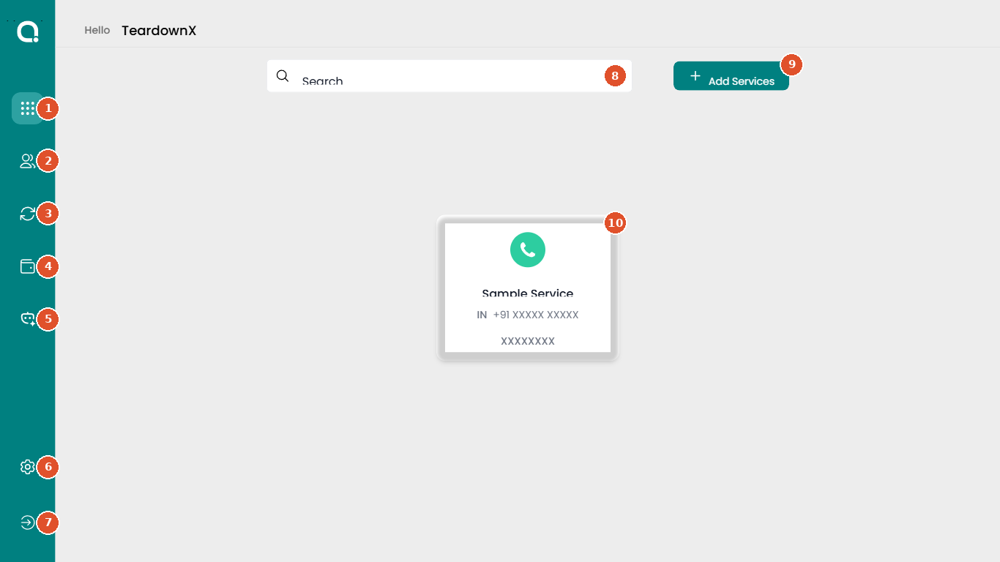

# Apps (home)

Connle › Home · Sign in to connle.telecmi.com › Apps (first icon in the left menu)

The first screen after signing in. It greets the account ("Hello", followed by the account name) and lists every service the account has as a card. From here you open a service, add a new one, or jump to users, activity, wallet, AI and settings from the left menu.

!!! warning "Needs review"
    Drafted from the live Connle account on 23 Sep 2026. The service name, phone number and service ID are hidden in the screenshot. A product expert needs to confirm **who can access** this screen and **which plans** include it.

| Who can access | Plans | Last checked |
|---|---|---|
| To confirm | To confirm | 23 Sep 2026 |

## Controls on this screen

| # | Control | Type | What it does | Default | Notes |
|---|---|---|---|---|---|
| 1 | **Apps** | Menu item | Opens this home screen, which lists every service on the account. | Selected when you sign in | — |
| 2 | **Users** | Menu item | Opens the Users list, where you add users one at a time (Add User), in bulk (Add Bulk Users) or combine duplicates (Merge Users). Each user shows their name and email ID. | — | Full details belong in the Users screen entry. |
| 3 | **User Activity** | Menu item | Opens a feed of user activity that you can filter by user, status and app. | All Users, All Status, All Apps | The icon has no label; the name only shows on hover. |
| 4 | **Wallet** | Menu item | Shows the account balance with separate tabs for Voice, WhatsApp and Special, and an Add Money button to top up. | Voice tab | Balances are per service, not one shared balance. |
| 5 | **Speechriv** | Menu item | Opens the AI section, which lists the account's AI agents and has an Add AI button to create one. | — | The name only shows on hover. |
| 6 | **Settings** | Menu item | Opens account settings with four tabs: Profile, Administrator, Privacy and Audit Log. Profile holds personal information and security options such as two-factor authentication. | Profile tab | — |
| 7 | **Logout** | Menu item | Signs you out of Connle. | — | There is no confirmation step. |
| 8 | **Search** | Text field | Filters the service cards on this screen as you type. | Empty | Searches only the services listed here, not users or calls. |
| 9 | **Add Services** | Button | Starts a four-step wizard to add a service: Service, Number, Plan, Checkout. The first step offers Voice, AI, SMS and WhatsApp. | — | SMS appears greyed out in the wizard. Close leaves without adding anything. |
| 10 | **Service card** | Button | One card per service, showing its name, country, phone number and service ID. Click it to open that service's workspace, which starts on the Live Feed (waiting customers, speaking customers, active agents). | — | Phone number and ID are hidden in this screenshot. |

## Common mistakes

- The left-menu icons have no text labels. Names appear only on hover, so new users often don't know where Users, User Activity or Wallet are.
- Clicking a service card opens that service's own workspace with a different left menu. Use the Connle logo or the Apps grid (top right) to get back.

## Related screens

Users, User Activity, Wallet, Speechriv, Settings, Add Services wizard, Service Live Feed
