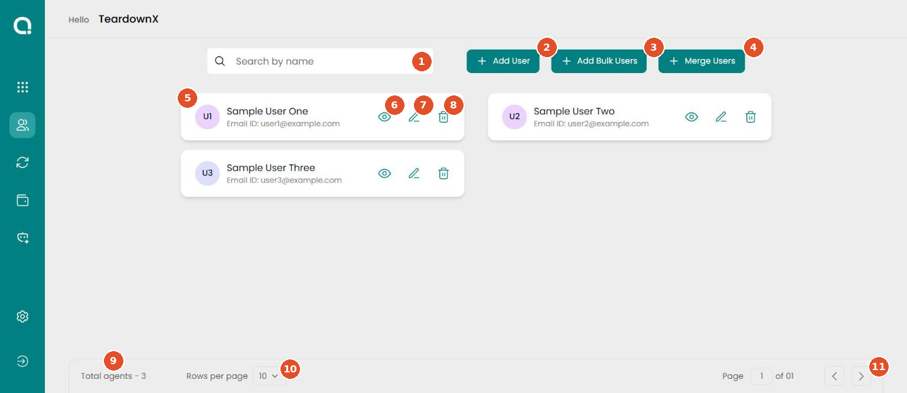

# Users

Connle › Users · Left menu › Users (second icon, person outline)

Lists everyone who can sign in to the account. From here you add people one at a time or from a CSV file, look up a person's details, change them, or remove them.

!!! warning "Needs review"
    Drafted from the live Connle account on 24 Sep 2026. User names and emails are replaced with sample values in the screenshot. A product expert needs to confirm **who can access** this screen, **which plans** include it, what **Merge Users** does, and the **CSV columns** bulk upload expects.

| Who can access | Plans | Last checked |
|---|---|---|
| To confirm | To confirm | 24 Sep 2026 |

## Controls on this screen

| # | Control | Type | What it does | Default | Notes |
|---|---|---|---|---|---|
| 1 | **Search by name** | Text field | Finds users by name. | Empty | — |
| 2 | **Add User** | Button | Opens the **Add New User** form: First Name, Last Name, Email Address, Phone Number (with a country picker), Role, Password and Confirm Password. All fields are required. **Add User** at the bottom creates the user. | — | Role offers two options: **Admin** or **User**. |
| 3 | **Add Bulk Users** | Button | Opens an upload window. Drag and drop a file, or click **Select file**, then click **Upload**. | — | CSV files only, up to 100 users per file. **Upload** stays greyed out until a file is chosen. The screen doesn't say which columns the CSV needs. |
| 4 | **Merge Users** | Button | Opens an upload window with the same layout and limits as Add Bulk Users (CSV only, up to 100 users). | — | The window has no title or explanation. Product team to confirm how merging differs from adding. |
| 5 | **User card** | Card | One card per user, showing initials, name and email ID. | — | — |
| 6 | **View** (eye icon) | Button | Opens **Profile Information**: name, email address, phone and role. Read-only. | — | Close with the × at the top right. |
| 7 | **Edit** (pencil icon) | Button | Opens **Edit Information**: first and last name, email, phone, role, Job Title (optional), password and confirm password, plus a **2FA** toggle. **Update** saves the changes. | — | The 2FA toggle sits at the top right of the form and is easy to miss. It isn't offered when adding a user. |
| 8 | **Delete** (bin icon) | Button | Removes the user from the account. | — | Not tested. Check whether it asks for confirmation before relying on it. |
| 9 | **Total agents** | Text | Number of users on the account. | — | Says "agents" while the rest of the screen says "users". They mean the same thing. |
| 10 | **Rows per page** | Dropdown | How many user cards to show per page: 5 or 10. | 10 | — |
| 11 | **Page controls** | Buttons | Current page number, total pages, and previous and next arrows. | Page 1 | — |

## Common mistakes

- **Add Bulk Users** and **Merge Users** open upload windows that look identical. Check which button you clicked before uploading.
- Bulk upload accepts at most 100 users per file. Split bigger lists into several files.
- Only two roles exist: **Admin** and **User**. Give Admin only to people who manage the account.
- Two-factor authentication can only be turned on from **Edit**, after the user has been created.
- The count at the bottom says "agents". It includes everyone listed, admins too (to confirm).

## Related screens

[Apps (home)](../home/apps-home.md), User Activity, Settings › Administrator
